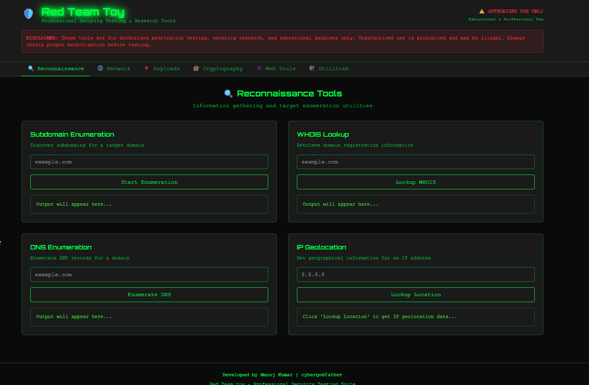
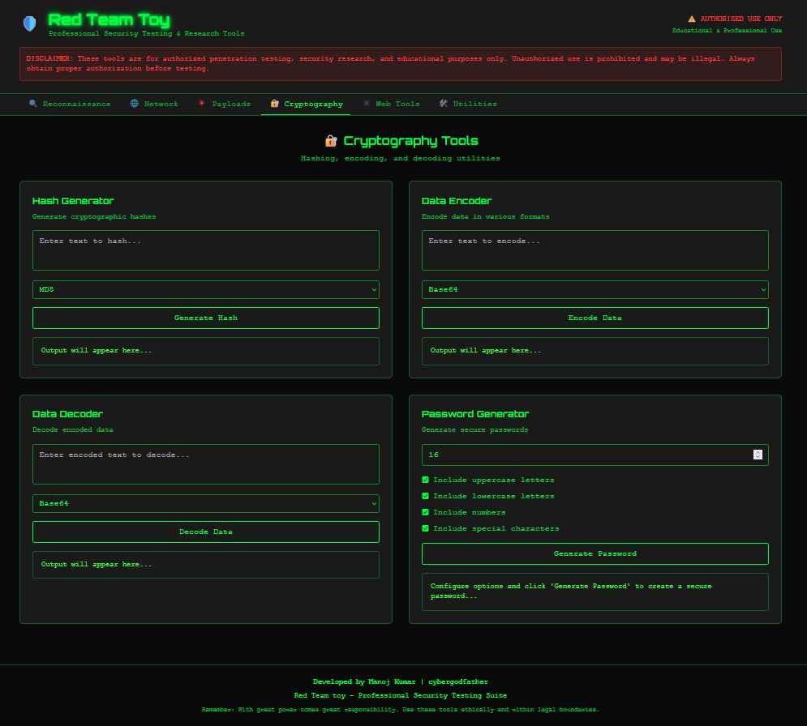

Red Team Toy 🛠️

A web-based offensive security toolkit for ethical hackers, red teamers, and learners.
Built with React, Vite, TypeScript, and Tailwind CSS.

    ⚠️ Disclaimer: This project is for authorized penetration testing, security research, and educational purposes only.
    Unauthorized use is prohibited and may be illegal. Always obtain proper written permission before testing any system.

✨ Features
Reconnaissance

    Subdomain Enumeration – Discover subdomains for a target domain

    WHOIS Lookup – Retrieve domain registration details

    DNS Enumeration – Enumerate A, MX, TXT, NS, and other records

    IP Geolocation – Get rough geo info for an IP

Planned / Roadmap

    🔐 Cryptography tools (encoders/decoders, hash utilities)

    🛰️ Network tools (port scan front-ends, banner grabbers via APIs)

    🧪 Payload generators (XSS, LFI/RFI, SQLi cheats)

    🕷️ Crawler / endpoint mapper

    💻 Desktop build via Electron or Tauri

    🧰 CLI companion (Node/Python)

🖼️ Screenshot

📦 Getting Started
Prerequisites

    Node.js ≥ 16

    npm or pnpm or yarn

Install

git clone https://github.com/<your-username>/red-team-toy.git
cd red-team-toy/project
npm install

Run (dev)

npm run dev

The dev server runs on http://localhost:3000 (LAN-exposed per vite.config.ts).
Build (prod)

npm run build
npm run preview

📁 Project Structure (simplified)

project/

├── src/

│   ├── components/

│   ├── pages/

│   ├── hooks/

│   ├── utils/

│   └── main.tsx

├── index.html

├── tailwind.config.js

├── postcss.config.js

├── vite.config.ts

├── tsconfig.json

└── package.json

🔐 Security & Legal

    Use only on targets you own or are explicitly authorized to test.

    Some modules may rely on third‑party APIs; respect their ToS.

    Consider rate-limiting & logging if you expose this publicly.

🤝 Contributing

Contributions, feature requests, and bug reports are welcome!

    Fork the repo

    Create a feature branch: git checkout -b feat/some-feature

    Commit with a clear message

    Open a Pull Request

    
(You can add a CONTRIBUTING.md later if you want stricter guidelines.)
